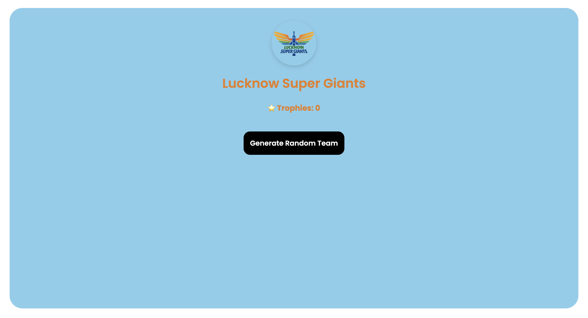

## 🏏 IPL Team Randomizer
A simple and responsive web app that randomly selects an IPL team and updates the UI with team colors, logo, and trophy count. Built with HTML, SCSS, and Vanilla JavaScript.


## 🔗 Live Demo
👉 **Live Site:** https://dev-hamza03.github.io/ipl-random-team-generator/  
👉 **GitHub Repo:** https://github.com/dev-hamza03/ipl-random-team-generator


## 📸 Screenshot



## 🚀 Features
- Random IPL team generator  
- Dynamic background & text color  
- Team logo update  
- Trophy count display  
- Smooth transitions  
- Responsive UI  


## 📁 Folder Structure
```
IPL-Team-Randomizer/  
├── index.html  
├── style.css  
├── style.scss  
├── script.js  
├── README.md  
└── assets/  
    └── images/  
        ├── CSK-img.png  
        ├── MI-img.png  
        ├── KKR-img.png  
        ├── SRH-img.png  
        ├── RR-img.png  
        ├── RCB-img.png  
        ├── DC-img.png  
        ├── LSG-img.png  
        ├── GT-img.png  
        ├── PBKS-img.png  
        └── screenshot.png  
```

## 🛠 Tech Stack
- HTML5  
- SCSS  
- JavaScript (ES6)  
- Live Server
  

## 🧩 IPL Team Data Example
```
{
  "team": "CSK",
  "fullName": "Chennai Super Kings",
  "primary": "yellow",
  "secondary": "#0A3D62",
  "trophies": "⭐ Trophies: 5",
  "logo": "./assets/images/CSK-img.png"
}
```


## 💻 How to Run Locally
```
git clone https://github.com/dev-hamza03/ipl-random-team-generator.git  
cd ipl-random-team-generator  
code .
```
Run with Live Server


## 📱 View on Mobile (Same Wi-Fi)
Windows: ipconfig  
Mac: ifconfig  
Open on your phone: http://YOUR-LAPTOP-IP:5500  
Live Server host must be: 0.0.0.0  


## 🚀 Deploy on GitHub Pages
Settings → Pages → Deploy from branch  
Branch: main  
Folder: root  
Live URL: https://dev-hamza03.github.io/ipl-random-team-generator/


## ❗ Troubleshooting
- CSS/JS not loading → wrong file path  
- Images not loading → wrong filename  
- UI shrinking → use width: clamp(300px, 80vw, 400px)
  

## 🌟 Future Enhancements
- Animation on team change  
- Team selection history  
- Dark mode  
- Sound effects
  

## 🙌 Credits
Made by Hamza. Logos used only for learning/demo purposes.
